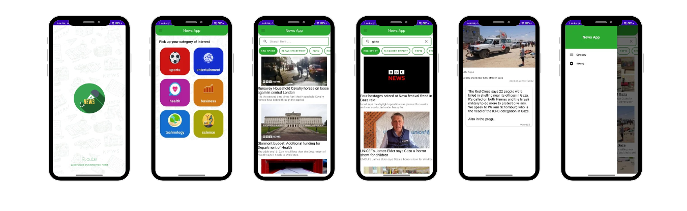

# News Application

Welcome to the News Application! This application provides the latest news from around the world, categorized by different topics. It features a powerful search functionality to find news articles based on your interests. The app is built using modern Android development technologies including Retrofit, LiveData, and ViewModel.

## ScreenShots



## Features

- **Global News**: Get news from all over the world.
- **Category-based News**: Browse news by different categories like Technology, Sports, Health, Business, Entertainment, and more.
- **Search Functionality**: Search for news articles by keywords.
- **Real-time Updates**: Stay updated with the latest news using LiveData.
- **Modern Architecture**: Built using ViewModel and LiveData for a robust and maintainable codebase.

## Technologies Used

- **Retrofit**: For making HTTP requests to the news API.
- **LiveData**: For updating the UI in real-time.
- **ViewModel**: For managing UI-related data in a lifecycle-conscious way.
- **API**: A third-party news API to fetch the latest news articles.

## Getting Started

### Prerequisites

- Android Studio 4.0 or higher
- Gradle 6.0 or higher

### Installation

1. Clone the repository:
   ```sh
   git clone https://github.com/yourusername/news-application.git
